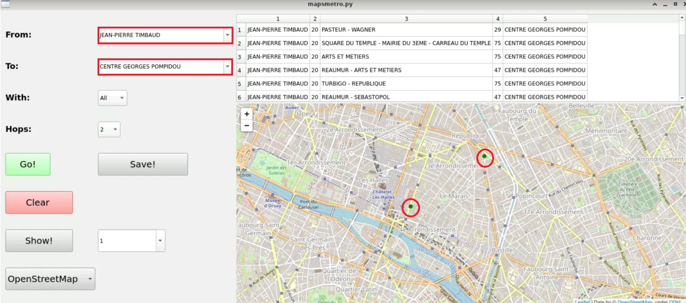

# CityMapper

## Présentation du projet

Ce projet a été réalisé lors de ma troisième année de Licence informatique avec deux autres camarades. 
Le but est de concevoir une application pour les transports en communs
pour qu’un utilisateur puisse connaître les différents modes de transports en indiquant
un point d’arrivée et un point de départ. Il permet également de trouver l’itinéraire le plus adapté à l’utilisateur. 
Grâce à cette application, chaque voyage est accompagné d’un filtre pour que l’utilisateur puisse
l’appliquer en fonction des préférences et de ses besoins personnels.

